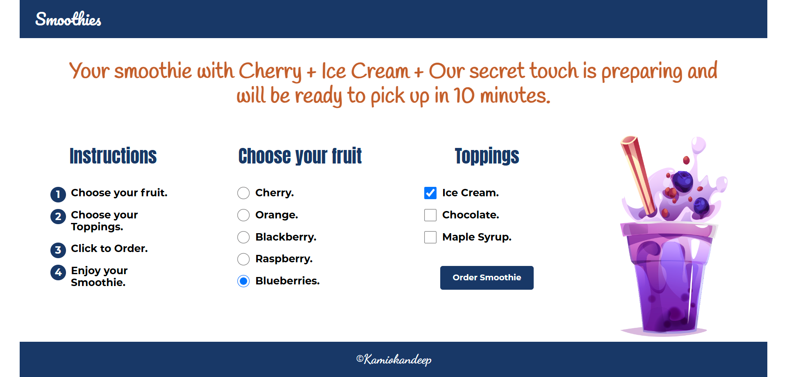

### The-Smoothie-Machine
Build a simple form that allows a user to order a smoothie, including a number of ingredients and other suitable characteristics. Include an ‘order’ button that creates a smoothie object and presents it to the customer.

&nbsp;

